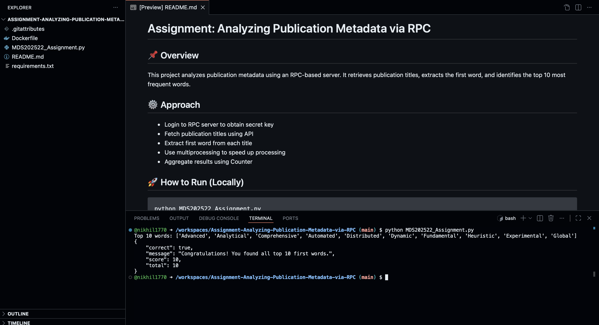

# Assignment: Analyzing Publication Metadata via RPC

## 📌 Overview
This project analyzes publication metadata using an RPC-based server. It retrieves publication titles, extracts the first word, and identifies the top 10 most frequent words.

## ⚙️ Approach
- Login to RPC server to obtain secret key
- Fetch publication titles using API
- Extract first word from each title
- Use multiprocessing to speed up processing
- Aggregate results using Counter

## 🚀 How to Run (Locally)

```bash
python MDS202522_Assignment.py

## 📸 Proof of Execution (Codespace)
Below is the screenshot verifying the successful execution of this application within the GitHub Codespace, achieving a 10/10 score:


